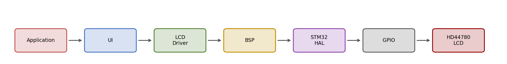

# HD44780 LCD Driver — EV Charger Firmware

A layered, portable HD44780 LCD driver written for an STM32F407VG-based EV charger (EVSE), supporting both 16x2 and 20x4 character displays over a 4-bit parallel interface.



This isn't just a GPIO-bit-banging LCD library — it's built as a proper layered subsystem: the application never touches a GPIO pin, the driver never touches a GPIO port directly, and the whole thing can be retargeted to a different board revision by rewriting one small file.

---

## Why This Exists

Most HD44780 "drivers" you'll find online are a single file that mixes protocol timing with direct register/pin access. That's fine for a demo, but it doesn't survive a real product:

- A PCB revision that moves one LCD pin to a different GPIO port shouldn't require touching protocol code.
- The charger's IEC 61851-1 state machine shouldn't know or care about DDRAM addresses.
- The driver should be unit-testable without a scope and a real LCD attached.

So this driver is split into two isolated layers:

| Layer | File(s) | Knows about |
|---|---|---|
| **BSP** (Board Support Package) | `bsp_lcd.c/h` | GPIO ports, pins, HAL calls — nothing about the HD44780 protocol |
| **LCD Driver** | `driver_lcd.c/h` | HD44780 command set, nibble/byte framing, DDRAM addressing — nothing about which GPIO port anything is wired to |

```
Application → UI → LCD Driver → BSP → STM32 HAL → GPIO → HD44780 LCD
```

Full rationale for every layer, every function, and every timing decision is documented in [`docs/HD44780_LCD_Driver_Engineering_Design_Manual.pdf`](docs/HD44780_LCD_Driver_Engineering_Design_Manual.pdf).

---

## Supported Hardware

- **MCU:** STM32F407VG (Cortex-M4, tested at 168MHz system clock)
- **Displays:** 16x2 and 20x4 HD44780-compatible character LCDs
- **Interface:** 4-bit parallel (RS, EN, D4–D7 — RW tied low, write-only)
- **HAL:** STM32Cube HAL (GPIO)

Switching between 16x2 and 20x4 requires changing exactly two macros in `driver_lcd.h`:

```c
#define LCD_ROWS        (4U)   // 2 for 16x2, 4 for 20x4/16x4
#define LCD_COLUMNS     (16U)  // 16 for 16x2/16x4, 20 for 20x4
```

---

## Quick Start

```c
#include "driver_lcd.h"

int main(void)
{
    HAL_Init();
    SystemClock_Config();
    MX_GPIO_Init();

    LCD_Init();
    LCD_Clear();

    LCD_SetCursor(0, 0);
    LCD_WriteString("EV CHARGER");

    LCD_SetCursor(1, 0);
    LCD_WriteString("STATUS: READY");

    while (1) { }
}
```

`LCD_Init()` performs the full HD44780 software-reset sequence (three `0x03` nibbles → `0x02` → function set → clear → entry mode → display on) so it works reliably even on low-cost clone controllers that don't trust the internal power-on reset.


---

## Design Notes

A few details worth knowing before you extend this driver — pulled from the full engineering manual:

- **`HAL_GPIO_WritePin()` is a single atomic write to the port's `BSRR` register**, not a read-modify-write on `ODR`. This matters if you're calling LCD functions from a context that could be interrupted mid-write.
- **20x4 displays are not four independent 20-byte DDRAM rows.** The HD44780 controller is still organized as two 40-byte rows; row 2 starts at address `0x14`, physically continuing inside the same bank as row 0. Row bases used here: `0x00, 0x40, 0x14, 0x54`.
- **`RW` is tied permanently low** (write-only interface) to save a GPIO pin, at the cost of never polling the busy flag — timing is instead guaranteed with fixed, datasheet-derived delays.
- All LCD I/O is layered *below* the charger's IEC 61851-1 state machine, never called from it directly — `LCD_Clear()` alone blocks for ~2ms, which is not something you want inside a safety-timing-critical control tick.


---

## Repository Structure

```
lcd-driver-hd44780/
├── README.md
├── LICENSE
├── docs/
│   ├── HD44780_LCD_Driver_Engineering_Design_Manual.pdf
│   └── img/
├── src/
│   ├── driver_lcd.c
│   ├── driver_lcd.h
│   ├── bsp_lcd.c
│   └── bsp_lcd.h
└── examples/
    └── main.c
```

---

## Full Documentation

The complete internal engineering design manual — architecture rationale, register-level explanation of every BSP/driver function, full timing analysis, DDRAM/CGRAM memory maps, debugging matrix, and EV charger integration guidelines — is in [`docs/HD44780_LCD_Driver_Engineering_Design_Manual.pdf`](docs/HD44780_LCD_Driver_Engineering_Design_Manual.pdf).

## Revision History

| Rev | Date | Notes |
|---|---|---|
| 1.0 | 2026-08 | Initial public release — BSP/driver review complete, GPIO port bug fixed |

## License

MIT — see [LICENSE](LICENSE).
